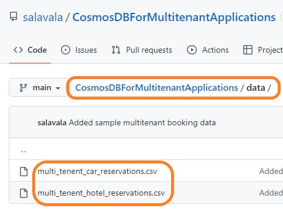
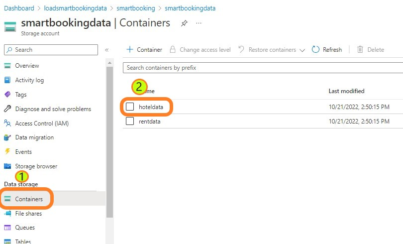
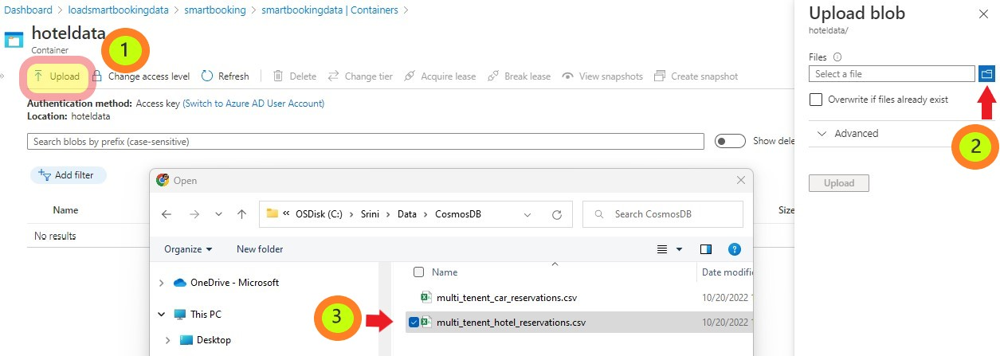
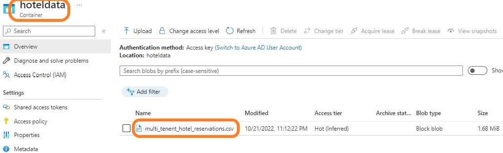
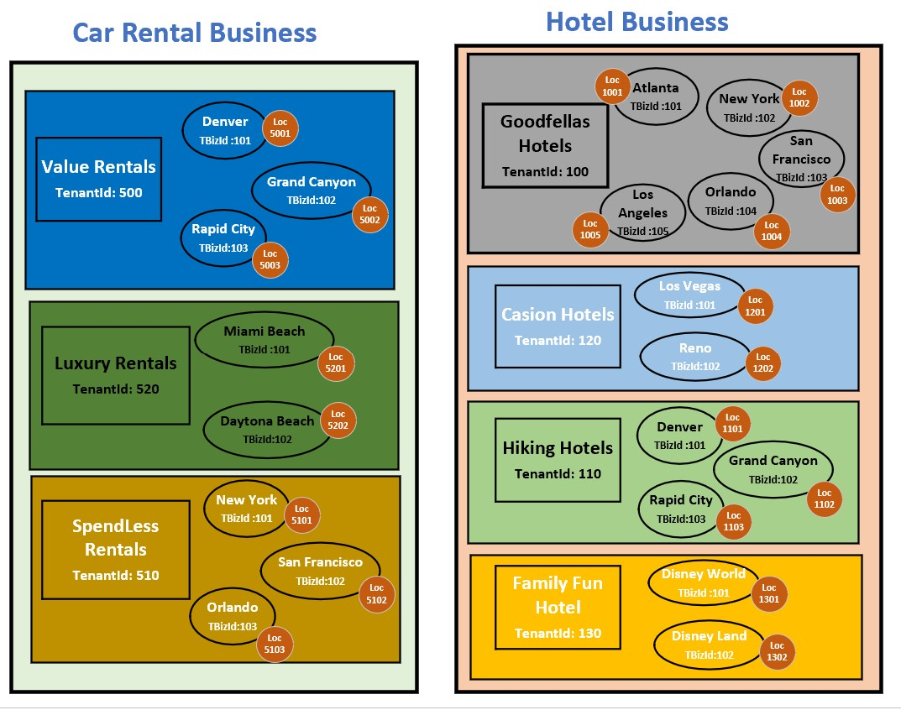
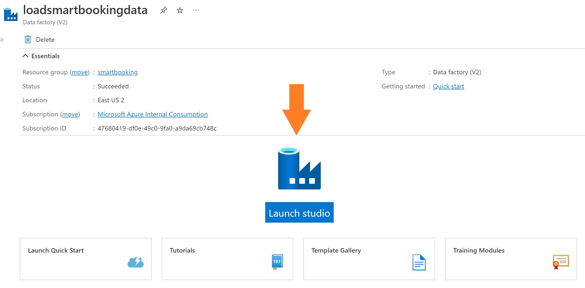
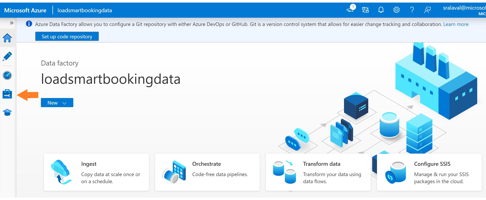
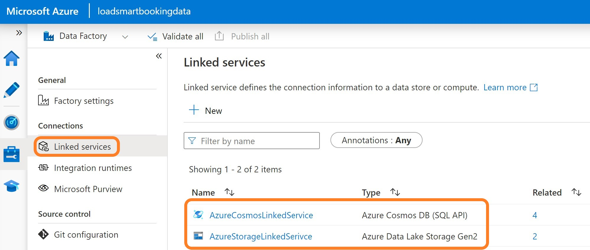

# Azure Cosmos DB for Multitenant Applications Workshop

## Cosmos DB Introduction

Azure Cosmos DB is a fully managed NoSQL database for modern multitenant application development. You can build applications fast with open source APIs, multiple SDKs, schemaless data and no-ETL analytics over operational data.
Single-digit millisecond response times, and instant scalability, guarantee speed at any scale.
Guarantee business continuity, 99.999% availability and enterprise-grade security for every application.
End-to-end database management, with serverless and automatic scaling matching your application and TCO needs.

Supports multiple database APIs including native API for NoSQL, API for Mongo DB, Apache Cassandra, Apache Gremlin and Table.

By using partitions with Azure Cosmos DB containers, you can create containers that are shared across multiple tenants. 
With large containers, Azure Cosmos DB spreads your tenants across multiple physical nodes to acheive a high degree of scale.

## Business Scenario
Fictitious ISV company called ""Smart Booking Inc"" has built an on-line reservation application called "EasyReserveApp" and deployed to Car Rental and Hotel business industries. 

It currently has the following clients:

Car Rental Industry:

	1) **Value Rentals** with offices in Denver, Grand Canyon & Rapid City. 
	2) **Luxury Rentals** with offices in Miami Beach & Daytona Beach.
	3) **Spendless** Rentals with offices in New York, San Francisco, Orlando. 

Hotel Industry:

	1) **GoodFellas** Hotels with offices in Atlanta, New York, San Francisco, Orlando, Los Angeles.
	2) **Hiking Hotels** in Denver, Grand Canyon & Rapid City.
	3) **Casino Hotels** in Los Vegas & Reno.
	4) **FamilyFun Hotels** with offices in Disney World & Disney Land.

Let us see how Azure Cosmos DB can be designed to support these small, medium and large customers.  

## Architecture Solution Diagram
 

## Descprtion of the other services:
1. Azure Storage Service (Azure Data Lake Service Gen2)
2. Azure Data Factory (ADF)

## Challenge-1: Deploy Azure Services  

1.1 Click the "Deploy to Azure" button

1.2. It display a custom deployment screen as shown below.

	
1.3 Select your region from the dropdown list for example "East US 2".

1.4 Click on "Review+create" button.

1.5 It completes the validation as the next step and click on 'create' button.

It will create the following services in your subscription:
* Azure Cosmos DB with 4 containers
* Azure Data Lake Storage Gen2 with 2 containers
* Azure Data Factory
* Configures Linked Services in ADF for both the Cosmos DB and ADLS Gen2
* Configures Datasets for the 4 Cosmos Db containers and the 2 ADLS containers

It may take 2 to 5 minutes to create the services.

1.6 Click on "Go to resource group" when the deployment is complete.

It will take you to your resource group showing the installed services.

You have successfully deployed the services to Azure. Congratulations for completing your first challenge.

## Challenge-2: Load sample multitenant data in Azure Storage Account

2.1 Download the EasyReserveApp Multitenant data from the repo data folder to your laptop folder

### Load Hotel Reservation Data: 

2.2 Select the Storage Account Service from the Resource group Overview screen (above screen)

2.3 Upload Hotel booking data into hotel storage container.

Click-1: Select Upload button on the hotel data container overview screen.
Click-2: It will open up ""Upload blob"" window and Select the File Folder icon.
Click-3: Browse through your laptop and select the downloaded 'multi_tenent_hotel_reservations.csv' file

You would see csv file in the container after successful upload operation.

### Load Rental Car Reservation Data:

2.4 Select Containers bread crumb and then select 'rentdata' container from the list to upload the sample data.
Repeat the above steps and upload data from 'mult_tenent_car_reservations.csv' file.

You have successfully loaded the sample booking data into a storage account. 

Congratulation, You have completed the second challenge and now you know how to store data in Azure Storage accounts!!

## Challenge-3: Design Cosmos DB Accounts to serve small, medium and large customers

Review the reservation data for Car and Hotel industries. 

**TenantId**: Application has assigned a unique 'tenantId'' for each business entity.
**TenantBizId**: Application has assigned a unique 'tenantBizId' for each of the serving offices with each business entity.
**LocationId**: Application has assigned a unique "LocationId" for each address associated with an operating unit of all businesses. 

### Small size customers - 
Create a Shared container with partition key per tenant

### Partitioning Strategy for many mid size customers
Group customer data into each container based on the line of business

Create container per each tenant 

### Partitioning Strategy for large customers
Create dedicated container per each tenant and restrict through put for a noisy neighbor 

Create one database account for customer

### Tenant Data larger than 20 GB: 

## Challenge-4: Build ADF Pipelines to load data into Cosmos DB

4.1 Select Azure Data Factory service from the above picture.

It will show you the overview page of the ADF Service.

4.2 Click on the "Launch Studio" button to launch the designer studio for building the pipelines.

It will open up "Azure DataFactory Studio"" in a new window tab. 

4.3 Select "Admin" box as shown in the picture to validate the Data Source Connection(Linked) services

It will take you to the admin page. Select the "linked services"" if it is not selected already. 

It will list the data source linked services to Cosmos DB and Storage account.

4.4 Select Cosmos DB linked Service to test the connectivity.

It will show the edit screen with the connection configuration. You can explore the options to authenticate 
such as "Account Key", "Service Principal", "System Assigned Managed Identity", "User Assigned Managed Identity" 
and access options such as "Cosmos DB Access Key" or ""Azure Key Vault".

4.5 Click on "Test connection" to verify the connectivity.

4.6 Follow the same way to test the connectivity to the storage account.

## Challeng-4: Build ADF pipelines to load data into Cosmos DB

## Challeng-5: Validate the partitioning strategies

