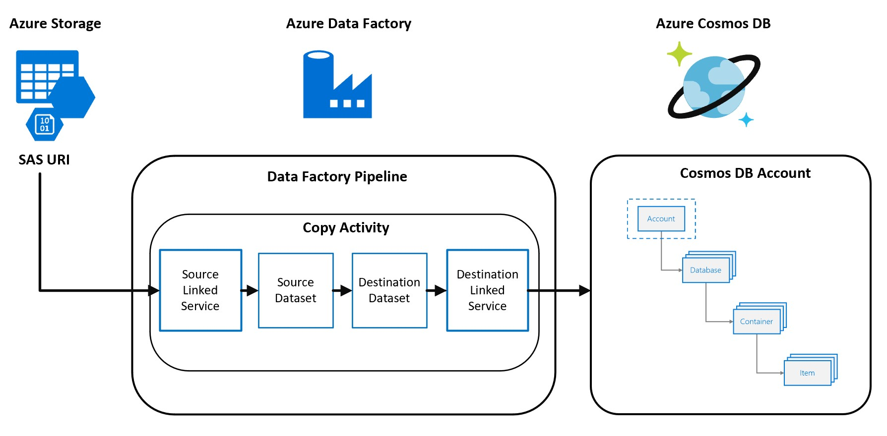
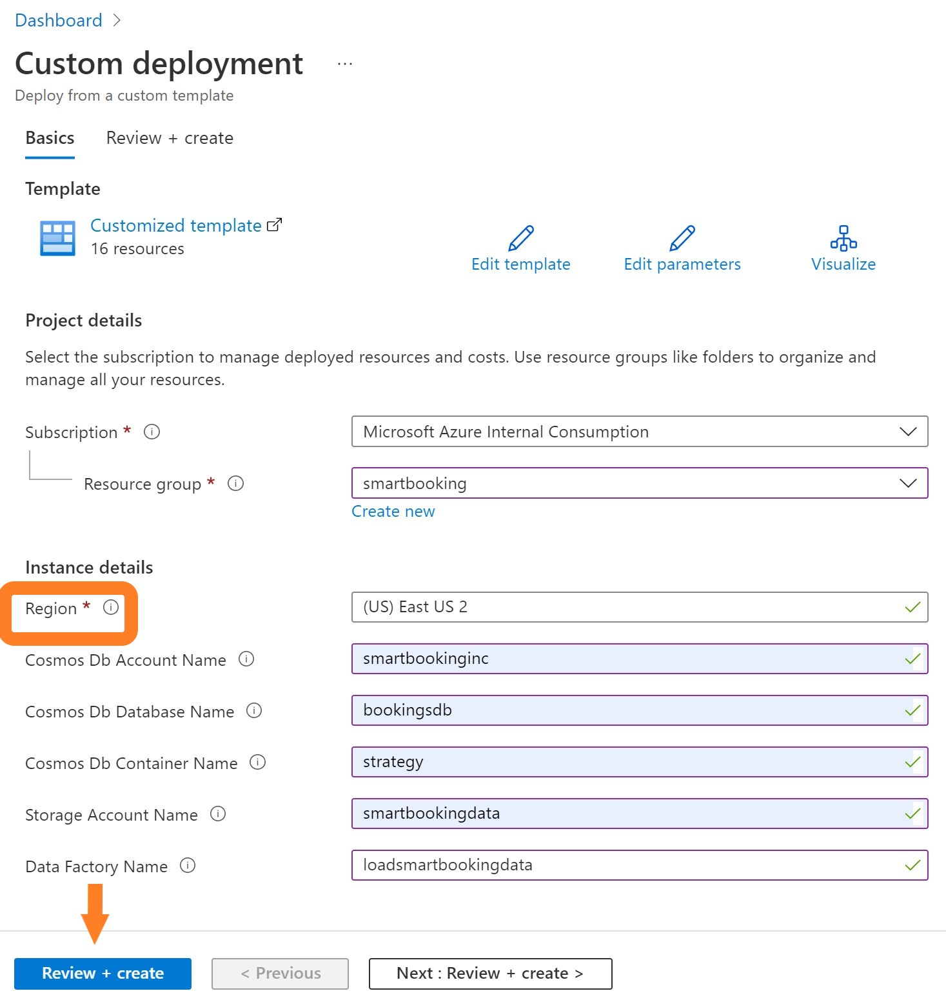
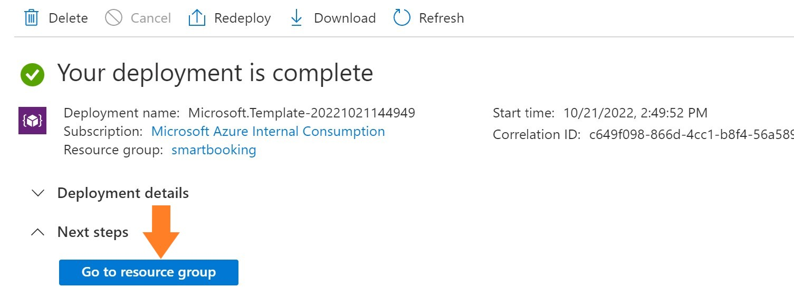
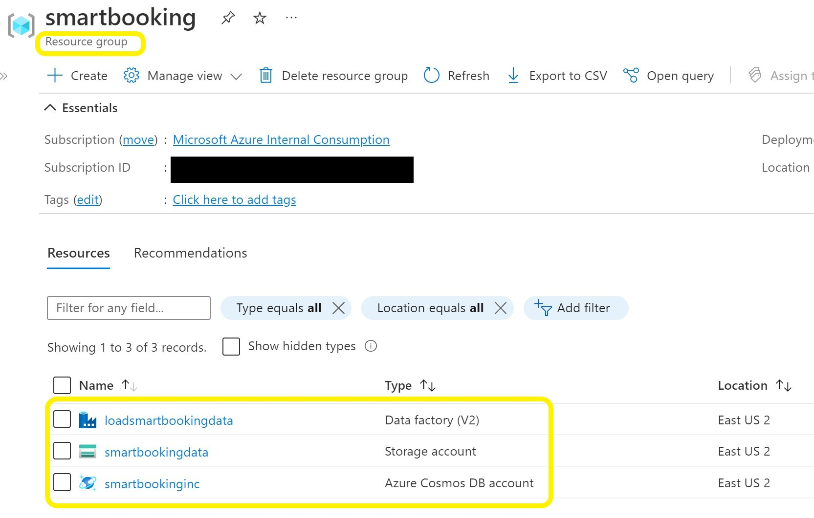

# Azure Cosmos DB for Multitenant Applications Workshop

## Cosmos DB Introduction
Multi Tenancy Value

## Business Scenario

List of companies and its business locations
Sample of of the data

## Architecture Solution Diagram
 

## Descprtion of the other services:
1. Azure Storage Service (Azure Data Lake Service Gen2)
2. Azure Data Factory (ADF)

## Challenge-1: Deploy Azure Services  

1. Click the "Deploy to Azure" button

2. It display a custom deployment screen as shown below.

	
2.1 Select your region from the dropdown list for example "East US 2"
2.2 Click on "Review+create" button. 
2.3 It completes the validation as the next step and click on 'create' button.

It will create the following services in your subscription:
* Azure Cosmos DB with 4 containers
* Azure Data Lake Storage Gen2 with 2 containers
* Azure Data Factory
* Configures Linked Services in ADF for both the Cosmos DB and ADLS Gen2
* Configures Datasets for the 4 Cosmos Db containers and the 2 ADLS containers

It may take 2 to 5 minutes to create the services... 
2.4 Click on "Go to resource group" when the deployment is complete.

* It will take you to your resource group showing the installed services.

## Challenge-2: Load data into Azure Storage Account

## Challenge-3: Validate Partitioning Strategies
1. Partitioning Strategy for many Small size customers
2. Partitioning Strategy for many mid size customers
3. Partitioning Strategy for large customers
4. Partitioning Additional options

## Challeng-4: Build ADF pipelines to load data into Cosmos DB

## Challeng-5: Validate the partitioning strategies

